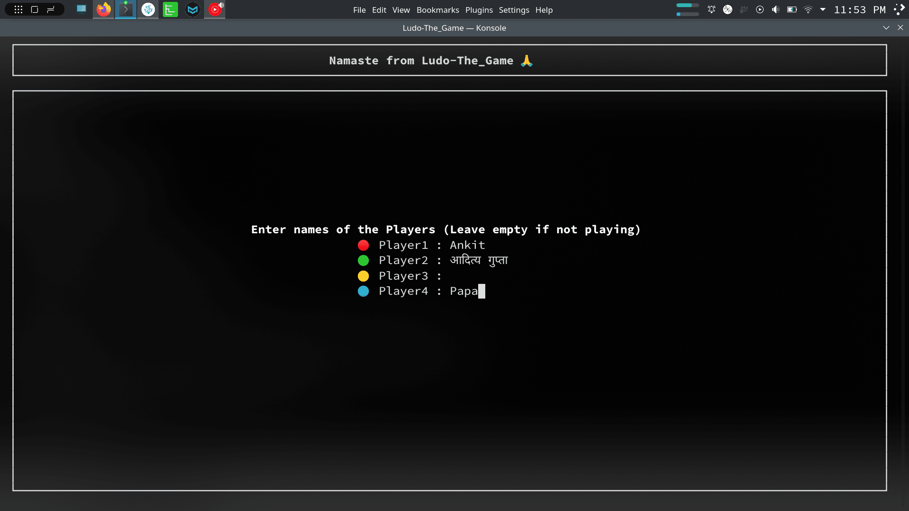

# Ludo-The Game (in Rust)

Did it as a refresher on rust, it is totally inspired from [Ludo-The Game](https://github.com/adi-g15/Ludo-The_Game). Why duplicate my project ? ... :)



### Running

Install [rust](https://doc.rust-lang.org/stable/book/ch01-01-installation.html) and cargo, simple way is [rustup](rustup.rs/#install)

```sh
cargo run --release
```

### Features:
* Built in separate components:
  - engine - Game Engine (say an API that internally does all the state keeping and internal logic of Ludo)
  - display- Display component using `crossterm` library, and COMPLETELY separate from this, you can very well use it in other 'Ludo' games, just provide array of strings and coords to box to print at.
  - game   - The Ludo Game, using the engine and display component... consider it a 'reference implementation' of using the 'LudoEngine'

* Ludo Engine: Complex term for a simple thing, does all internal logic of Ludo, say you are building an "All in one" game, you can just take this engine (inside the 'src/engine' directory), and built a perfectly working ludo component
* Bas itna hi : )
